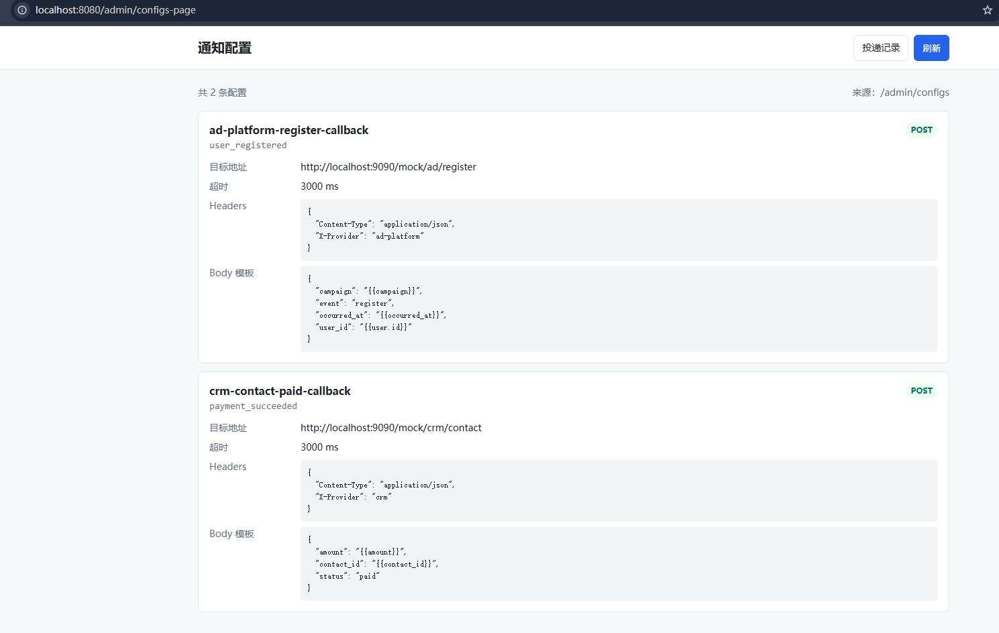
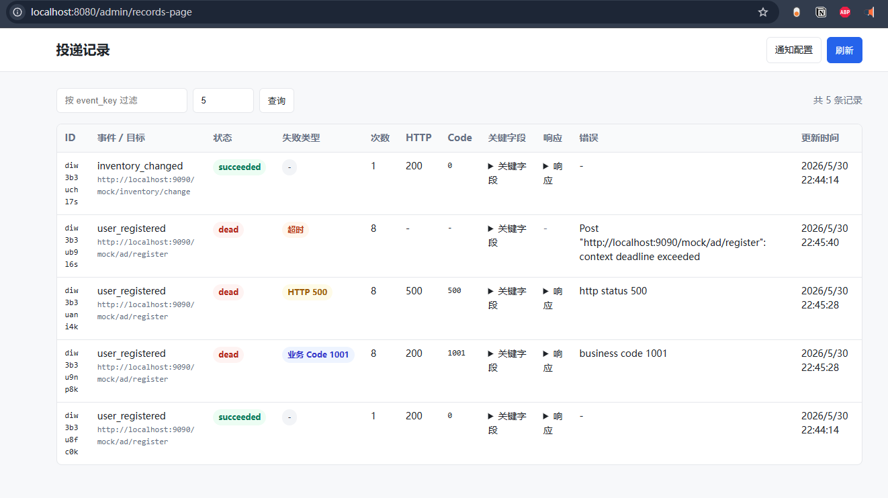

# API Notify System

基于 Golang + Hertz 的内部 HTTP 通知投递服务 MVP。服务接收业务系统提交的事件，根据配置调用外部供应商 HTTP API，并记录投递结果、失败原因、关键字段和死信记录。

## 对问题的理解

企业内部多个业务系统都会在关键事件发生后通知外部系统，例如广告平台注册回传、CRM 状态变更、库存变更等。不同外部供应商的 API 地址、Header、Body 格式、返回格式和稳定性都不同，如果这些细节散落在各业务系统里，会带来重复开发、失败处理不一致、排查困难等问题。

这个服务的职责是把“业务事件发生了”转换成“可靠地通知某个外部 HTTP API”。业务方只需要提交事件标识和事件数据，不需要关心外部 API 的具体协议，也不需要自己实现重试、死信、记录查询和补偿重放。

## 整体架构与核心设计

当前实现是一个单进程 MVP，核心模块如下：

- `cmd/server`：服务启动入口，加载配置、选择存储实现、启动 Hertz HTTP 服务。
- `internal/config`：读取 `config/providers.json`，维护 `event_key -> 外部 API 配置`，并定时热加载。
- `internal/httpapi`：HTTP API 和静态页面路由。
- `internal/notifier`：通知投递核心逻辑，包括模板渲染后的投递、重试、降级、死信和重放。
- `internal/queue`：投递队列抽象，默认提供内存队列用于本地演示，也提供 Kafka 队列用于接近生产的异步消费；失败时通过 `next_run_at` 和重新入队实现退避重试。
- `internal/store`：投递记录存储接口，提供内存实现和 MySQL/GORM 实现。
- `internal/template`：支持 `{{user.id}}` 这类简单路径模板渲染，并提取关键字段。
- `web`：两个简洁管理页面，展示配置和投递记录。
- `scripts`：本地演示脚本，用来启动 mock 外部 API 和批量生成不同状态的投递记录。

核心流程：

```text
业务系统
  -> POST /api/events/:event_key/notify
  -> 根据 event_key 查配置
  -> 渲染 Header/Body 所需数据
  -> 创建投递记录
  -> dispatch_mode=queue：直接写入投递队列
  -> dispatch_mode=direct：当前请求内立即尝试投递
  -> direct 失败后写入投递队列
  -> queue consumer 读取记录 ID 并继续投递
  -> 失败则更新 next_run_at 后重新写入队列
  -> 达到上限后标记 dead
  -> 管理页查询记录或触发重放
```

主要接口：

- `POST /api/events/:event_key/notify`：提交事件通知。
- `GET /admin/configs`：查看当前配置。
- `GET /admin/records`：查看投递记录。
- `GET /admin/dlq`：查看死信记录。
- `POST /admin/records/replay`：按时间范围、状态、事件、降级标识重放失败记录。
- `GET /admin/configs-page`：配置展示页。
- `GET /admin/records-page`：投递记录页。


## 系统边界

### 本系统选择解决的问题

- 根据 `event_key` 找到对应外部 API 配置。
- 支持配置化 HTTP Method、URL、Header、Body 模板。
- 支持配置化投递模式：`queue` 进入投递队列，`direct` 在请求内立即尝试投递。
- 支持从事件 payload 中提取关键字段，方便查询和排查。
- 支持外部 API HTTP 状态失败、业务 `code != 0`、超时、连接失败等失败识别。
- 支持至少一次投递、立即重试、退避重试、死信记录。
- 支持按失败记录时间范围进行补偿重放。
- 支持简洁管理页面，用于展示配置和投递记录。
- 支持默认内存存储和可选 MySQL/GORM 存储。

### 本系统明确不解决的问题

- 不保证 exactly-once。网络调用和外部系统状态不可控，生产中应依赖外部 API 的幂等能力。
- 不实现复杂的 retry topic / delayed topic / dead-letter topic 拆分。当前用队列承接消费，用记录表中的 `next_run_at` 表示退避时间；生产可进一步拆分队列拓扑。
- 不实现复杂配置审批、灰度发布和多租户权限。第一版重点是投递链路和工程判断。
- 不实现外部供应商 OAuth、动态密钥轮换等鉴权生命周期管理。当前仅支持静态 Header。
- 不实现完整前端后台系统。页面只用于演示配置和投递记录，避免偏离后端作业核心。

## 可靠性与失败处理

### 投递语义

本系统选择 **至少一次投递**。

原因是 HTTP 通知存在超时、连接失败、响应丢失等情况，服务无法可靠判断外部系统是否已经处理成功。为了提高送达概率，失败时会重试；因此外部系统需要基于业务唯一键实现幂等。

### 失败判断

一次外部 API 调用被认为成功需要同时满足：

- HTTP 状态码为 2xx。
- 如果响应体是 JSON 且包含 `code` 字段，则 `code == 0`。

以下情况会被视为失败：

- HTTP 500 等非 2xx 状态。
- HTTP 200 但业务 `code != 0`。
- 请求超时。
- 连接失败，例如目标服务不可达。

### 重试与死信

默认策略：

- `queue` 模式直接写入投递队列，由 consumer 消费投递。
- `direct` 模式先在当前请求内立即重试 3 次；仍失败则写入投递队列。
- consumer 每次失败后更新记录的 `next_run_at`，并重新写入队列；下一次消费时会等待到 `next_run_at` 后再投递。
- 达到最大尝试次数后标记为 `dead`。
- 死信记录可通过 `/admin/dlq` 查询。
- 最终失败会输出微信告警日志占位，生产可替换为企业微信 webhook。

### 外部系统长期不可用

如果外部系统长期不可用，记录会最终进入死信。系统提供 replay 接口，在外部系统恢复后按时间范围重放失败记录：

```text
POST /admin/records/replay
```

该接口支持 `dry_run` 预览，避免误重放大量历史记录。

## 降级与重放

当前实现中，投递记录带有 `degradation` 字段，可标记轻度或重度降级场景：

- `light`：自身压力较大。`direct` 模式只在请求内尝试 1 次，失败后交给投递队列；consumer 也会缩短重试次数，避免队列堆积和告警风暴。
- `heavy`：下游不可用。直接快速失败，不继续调用外部 API，避免继续打挂下游。

## 投递模式

每个事件配置都可以通过 `dispatch_mode` 选择投递路径：

```json
{
  "event_key": "user_registered",
  "dispatch_mode": "queue"
}
```

`queue` 是默认值，表示创建投递记录后直接写入投递队列，适合用户注册回传、广告归因通知这类可以异步削峰的场景。

```json
{
  "event_key": "inventory_changed",
  "dispatch_mode": "direct"
}
```

`direct` 表示创建投递记录后先在当前请求内立即重试 3 次；如果仍失败，再写入投递队列，由 consumer 后续继续退避重试，适合库存变更这类希望尽快通知下游的场景。

重放接口示例：

```bash
curl -X POST http://localhost:8080/admin/records/replay \
  -H "Content-Type: application/json" \
  -d '{
    "from": "2026-05-30T10:00:00+08:00",
    "to": "2026-05-30T12:00:00+08:00",
    "event_key": "user_registered",
    "statuses": ["dead"],
    "degradation": "light",
    "reset_attempt": true,
    "dry_run": false,
    "limit": 100
  }'
```

参数说明：

- `from` / `to`：按记录 `updated_at` 筛选，格式为 RFC3339。
- `statuses`：默认只重放 `dead`；如确需重放退避中的记录，可传 `["retrying"]`。
- `degradation`：可选，按降级标识过滤。
- `dry_run=true`：只预览命中的记录 ID，不会重新入队。
- `reset_attempt=true`：重放前将尝试次数归零。
- `limit`：限制本次扫描数量，默认 100，最大 1000。

## 运行方式

安装依赖：

```bash
go mod tidy
```

启动服务：

```bash
go run ./cmd/server
```

默认监听 `:8080`，默认配置文件为 `config/providers.json`。

默认投递队列使用内存实现，适合本地演示：

```bash
QUEUE_DRIVER=memory go run ./cmd/server
```

如果要切换到 Kafka：

```bash
docker compose -f docker-compose.kafka.yml up -d
QUEUE_DRIVER=kafka KAFKA_BROKERS=localhost:9092 KAFKA_TOPIC=notification-delivery KAFKA_GROUP_ID=rc-notify-workers go run ./cmd/server
```

通用可选环境变量：

```bash
ADDR=:8081 CONFIG_PATH=config/providers.json go run ./cmd/server
```

默认使用内存存储：

```bash
STORE_DRIVER=memory go run ./cmd/server
```

切换到 MySQL/GORM 存储：

```bash
STORE_DRIVER=mysql MYSQL_DSN='user:password@tcp(127.0.0.1:3306)/rc_notify?charset=utf8mb4&parseTime=True&loc=Local' go run ./cmd/server
```

MySQL 模式会通过 GORM 自动创建或更新 `delivery_record_models` 表。


## 演示脚本


- `scripts/mock-api.ps1`：启动本地 mock 外部 API，模拟成功、业务失败、HTTP 失败、超时。
- `scripts/seed-demo-records.ps1`：批量发送演示事件，生成不同状态的投递记录。

运行顺序：

```powershell
# 终端 1：启动本服务
cd rc_notify_hertz
go run ./cmd/server
```

```powershell
# 终端 2：启动 mock 外部 API
cd rc_notify_hertz
powershell -ExecutionPolicy Bypass -File .\scripts\mock-api.ps1
```

```powershell
# 终端 3：生成演示数据
cd rc_notify_hertz
powershell -ExecutionPolicy Bypass -File .\scripts\seed-demo-records.ps1
```

脚本会生成：

- 成功投递：HTTP 200 且 `code=0`。
- 业务失败：HTTP 200 但 `code=1001`。
- HTTP 失败：HTTP 500。
- 超时失败：mock API 睡眠超过服务超时时间。
- 库存变更：`inventory_changed` 使用 `dispatch_mode=direct`，先立即重试，失败后再进入投递队列。
- 未配置事件：返回边界错误，不生成投递记录。

打开管理页面：

- 配置展示页：`http://localhost:8080/admin/configs-page`
- 投递记录页：`http://localhost:8080/admin/records-page`

演示 replay：

```powershell
powershell -ExecutionPolicy Bypass -File .\scripts\seed-demo-records.ps1 -ReplayDryRun
powershell -ExecutionPolicy Bypass -File .\scripts\seed-demo-records.ps1 -Replay
```
## 演示图片





## 未来演进

- 将当前 Kafka 重试进一步拆分为 retry topic / dead-letter topic，支持更清晰的避让重试和死信消费。
- 引入供应商级限流，降低重放和重试导致的重复通知风险。
- 增加配置管理后台、审批流、灰度发布和配置版本回滚。
- 增加供应商级熔断、隔离池、失败率监控和告警聚合。
- 将微信告警日志占位替换为真实企业微信 webhook。
- 如果未来通知流程变成多步骤状态机，再评估 Saga 或其他编排框架。
- 当前只支持 `{{a.b}}` 路径占位符，能覆盖配置化 Body 和关键字段提取。后期可考虑引入复杂模板语言或规则引擎。
